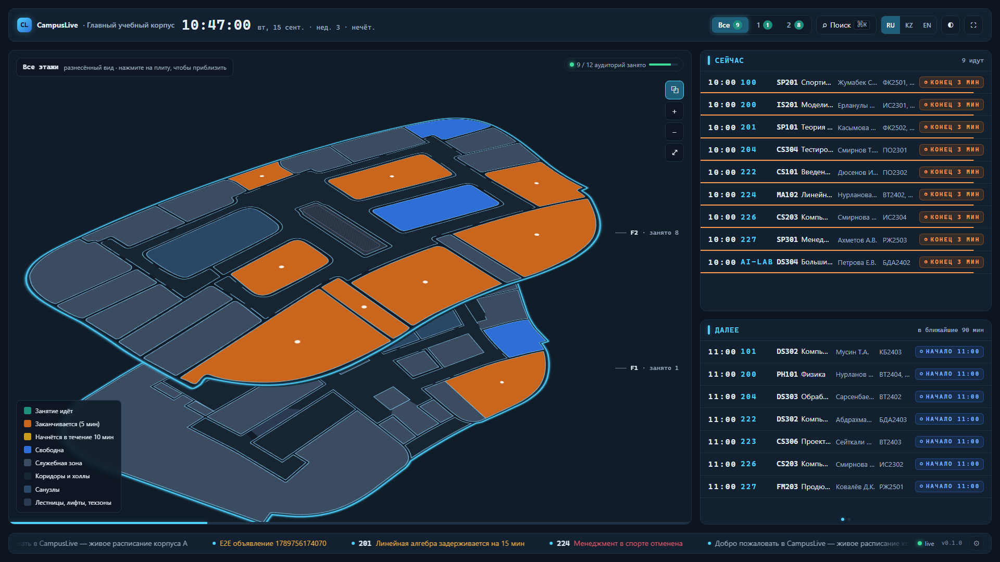
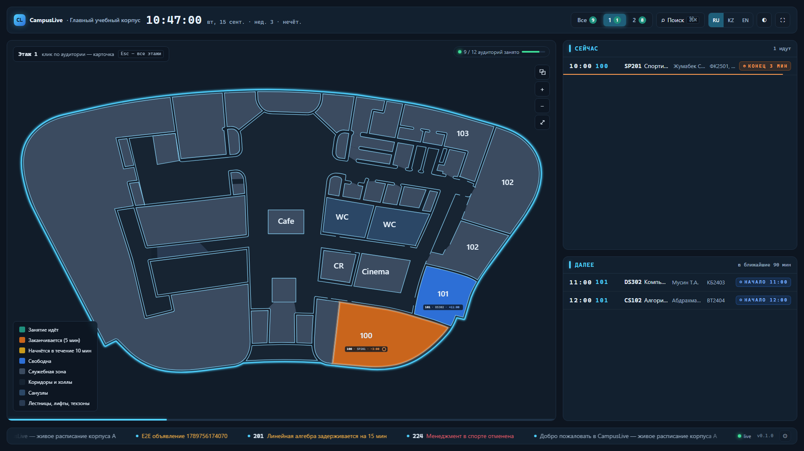
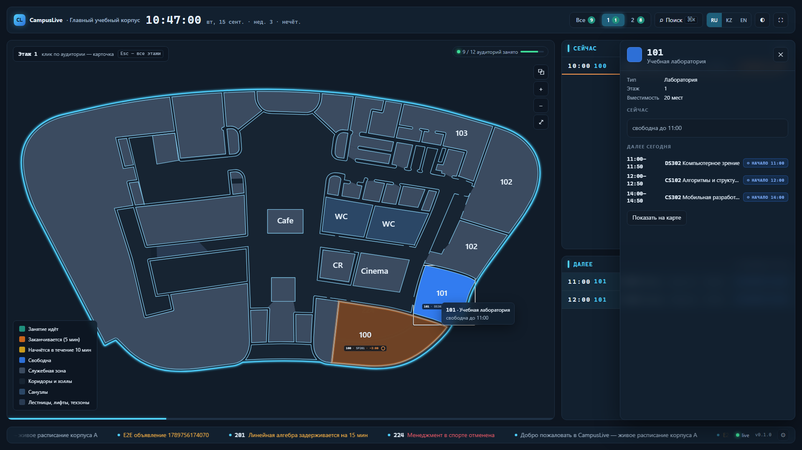
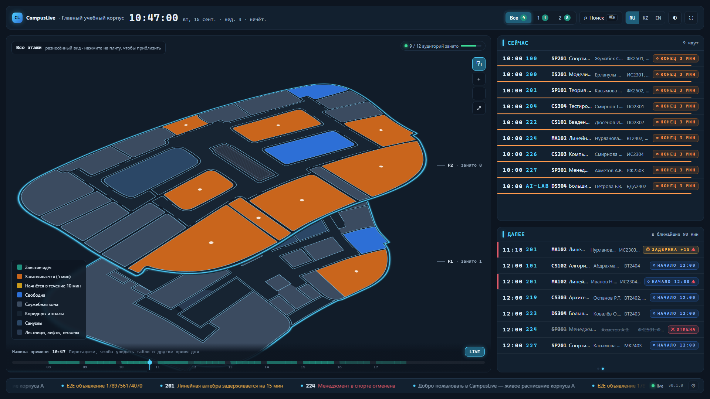
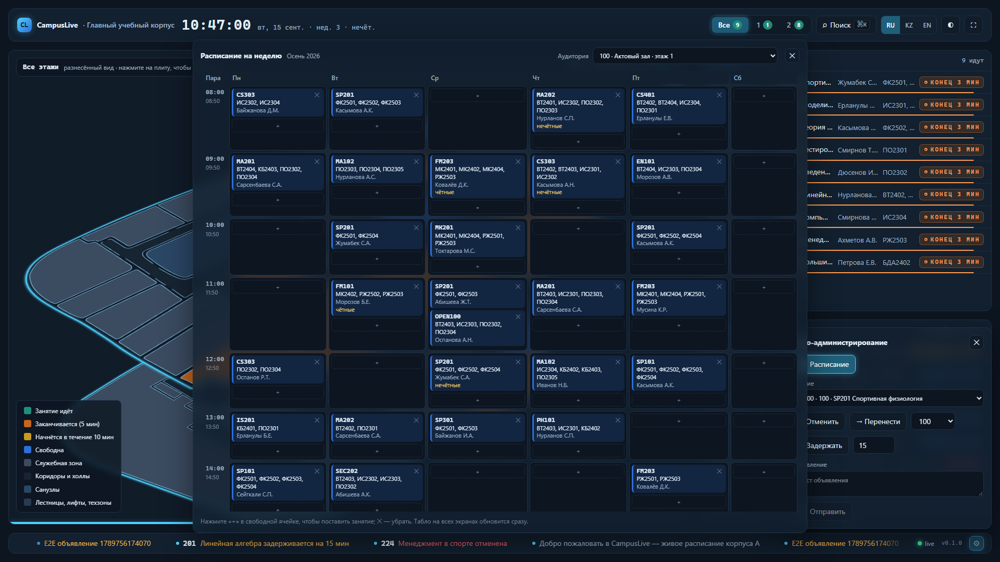

# CampusLive

Живая карта университетского корпуса в стиле аэропортового табло: на одном экране без скролла видно,
какие пары идут прямо сейчас, в каких аудиториях, кто их ведёт и что начнётся следующим. Статусы
меняются на всех открытых экранах меньше чем за секунду. Карта — настоящие чертежи двух этажей
(стены нарисованы в Illustrator и попадают на экран дословно), собранные в 2.5D-сцену.



| Фокус этажа | Карточка аудитории |
|---|---|
|  |  |
| Машина времени | Редактор расписания (админ) |
|  |  |

## Стек

Next.js 15 (App Router, RSC) · TypeScript 5 · Tailwind v4 · Framer Motion (`motion`) · Zustand · TanStack Query · next-intl (ru / kk / en) ·
Go 1.26 (`chi`, `pgx` + `sqlc`, `goose`, `oapi-codegen`, `slog`) · PostgreSQL 16 · SSE · pnpm workspaces + Turborepo · Docker Compose + Caddy ·
Vitest · Playwright · testcontainers-go · kin-openapi.

## Быстрый старт

Нужны Node 22, pnpm 10, Go 1.24+ и Docker.

```bash
pnpm install
pnpm map:build                 # vector/*.json + room-codes.json → building-a.json, vector-map.json, docs/BUILDING.md
pnpm db:up                     # PostgreSQL 16 в docker (порт 5434, проект campuslive-map)
pnpm seed                      # миграции + детерминированные демо-данные (seed 42)
pnpm dev                       # web http://localhost:3000 (Turbo: web + map-editor)
pnpm api                       # api http://localhost:8090
```

Или одной командой — стек «вторник 10:47» (часы сервера сдвинуты так, чтобы табло было живым в любой момент):

```bash
pnpm demo                      # postgres + seed + api (CLOCK_MODE=offset) + web на :3100
pnpm demo:script               # 90-секундный сценарий: отмена, перенос, задержка, объявления
```

Переменные окружения — `infra/.env.example`. Для детерминированных скриншотов и e2e: `CLOCK_MODE=fixed CLOCK_FIXED_AT=2026-09-15T10:47:00+05:00`.

Полный стек в Docker: `docker compose -f infra/docker-compose.yml --profile full up --build` → https://localhost:8443.

## Как это устроено

```
apps/web ──SSR: GET /board, /time──▶ первый кадр уже «живой»
   │  EventSource /api/v1/events?building=A  ◀── realtime.Broker ◀── scheduler (спит до nextTransitionAt)
   │  GET /board?at=  (машина времени)                                     ▲
   ▼                                                                       │ invalidate
Zustand: boardStore (snapshot, mode live|travel) · uiStore · timeStore     │
                                                          POST /admin/overrides ──┘
services/api: httpapi (oapi-codegen strict) → service.Board (кэш каталога + снимка) → engine (чистые функции) + repo (sqlc)
```

- **Один источник истины для статусов** — `services/api/internal/engine` (`BuildDayTimeline`, `ComputeSnapshot`, `NextTransition`).
  Фронт считает только проценты прогресса и обратный отсчёт по timestamp'ам.
- **Расписание** хранится как шаблоны `lessons` + точечные `session_overrides`; конкретный день материализуется на лету.
- **Время** идёт через `internal/clock` (`real` / `fixed` / `offset`) — e2e и демо детерминированы.
- **Контракт** — `packages/contracts/openapi.yaml`; Go-сервер и TS-типы генерируются из него, контрактные тесты валидируют каждый ответ.
- **Геометрия** — чертежи `packages/map-data/plans/*.svg` → `apps/map-editor/tools/svg2plan.py` (стены дословно, помещения между ними вычисляются)
  → `vector/*.json` → `vector-map.json` (что рисуем) и `building-a.json` (кто есть кто); коды, расписуемость и названия на ru/kk/en задаются в `room-codes.json` (программа помещений владельца), подписи на карте не меняются. Поиск ⌘K находит аудиторию по коду и названию на любом из трёх языков.
- **2.5D** — стопка этажей в CSS 3D (`rotateX(58°) rotateZ(-38°)`, `translateZ(i×gap)`); на плитах только точки идущих занятий, рядом — теги «F2 · занято 7» (кнопки), фокус этажа — плоский вид с подписями, zoom/pan; анимируются только `transform`/`opacity`. Светлая тема (◐) перекрашивает и карту.
- **Админ-панель** (⚙ в тикере, нужен `ADMIN_API_KEY`) — отмена/перенос/задержка занятия, объявления и 📅 редактор недельного расписания: сетка «пары × дни» по аудитории, «+» добавляет занятие, ✕ убирает; все экраны обновляются по SSE.

Подробно: [docs/ARCHITECTURE.md](docs/ARCHITECTURE.md) · программа помещений: [docs/BUILDING.md](docs/BUILDING.md) · статус фаз: [docs/STATUS.md](docs/STATUS.md).

## Команды

| Команда | Что делает |
|---|---|
| `pnpm dev` / `pnpm api` | web (Next dev) / Go API |
| `pnpm map:build` | пересобрать артефакты карты из `packages/map-data/vector` |
| `python apps/map-editor/tools/svg2plan.py && pnpm --filter @campuslive/map-editor gen:floors` | пересобрать `vector/*.json` из чертежей `packages/map-data/plans/*.svg` (python: numpy, opencv, shapely, svgelements, Pillow) |
| `pnpm contracts:gen` | TS-типы из `openapi.yaml`; Go: `cd services/api && go generate ./...` |
| `pnpm seed` | миграции + демо-данные |
| `pnpm test` | Vitest (web) + проверки пакетов; Go: `cd services/api && go test ./...` |
| `pnpm e2e` | Playwright против запущенных api (fixed clock) + web |
| `pnpm demo` / `pnpm demo:script` | демо-стек «вторник 10:47» и 90-секундный сценарий |
| `pnpm --filter @campuslive/map-editor dev` | редактор топологии планов (просмотр/правка `vector/*.json`) |

## Подключить настоящее расписание

Движок, API и фронт видят только `lessons` / `session_overrides`. Реализуйте `schedule.Source`
(`services/api/internal/schedule/source.go`) — `SeedSource` уже есть; `ExcelSource` (xlsx деканата) или
`ExternalAPISource` (LMS, polling + diff → overrides) пишут те же таблицы. Аудитории сопоставляются по `rooms.code`,
поэтому коды в `packages/map-data/room-codes.json` должны совпадать с кодами университета.

## Деплой

Vercel (web) + Fly.io (api + Postgres): [infra/deploy/README.md](infra/deploy/README.md).
