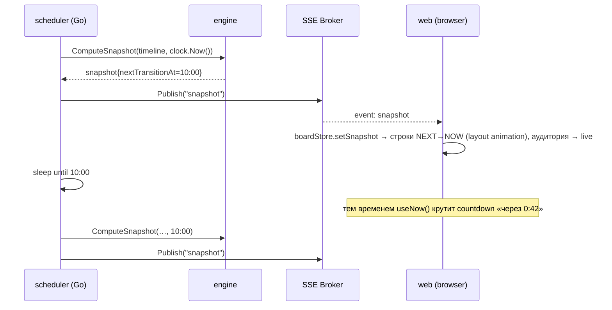

# CampusLive — архитектура проекта

> Живая карта университета в стиле аэропортового табло: на одном экране без скролла видно, где прямо сейчас идут пары, кто их ведёт, что начнётся следующим, и всё это обновляется в реальном времени. Демо-версия для портфолио на реалистичных mock-данных, спроектированная так, чтобы позже подключить настоящее расписание университета (AITU или любого другого).

Кодовое имя: **CampusLive**. Репозиторий: `campuslive`.

---

## 1. Цели, не-цели, жёсткие ограничения

**Цели**

1. «Табло вылетов» для университета: `NOW` (идут сейчас) и `NEXT` (скоро начнутся) с автоматическими переходами в момент начала/конца пары.
2. Интерактивная 2.5D-карта здания: этажи, аудитории, статус каждой аудитории, клик → подробности, поиск по преподавателю/группе/аудитории.
3. Всё ключевое — на одном экране 1920×1080 без скролла; масштабируется вниз до 1280×720 и вверх до 4K-киоска.
4. Realtime: изменения статуса появляются на всех открытых экранах не позже чем через 1 секунду после перехода.
5. Детерминированный демо-режим: можно «заморозить» или сдвинуть серверное время, чтобы показывать оживлённый рабочий день в любой момент суток (это критично для портфолио и e2e-тестов).

**Не-цели (v1)**

Аутентификация студентов, личные кабинеты, редактирование расписания через полноценную админку, навигация «как пройти», мобильное приложение. Для всего этого оставлены точки расширения, но в v1 они не делаются.

**Жёсткие ограничения**

| Ограничение | Как обеспечивается |
|---|---|
| Один экран, без скролла страницы | `h-dvh` grid-layout, табло само считает, сколько строк помещается, и пагинирует «страницами» как в аэропорту |
| 60 fps в анимациях | Анимируются только `transform`/`opacity`; `filter` — только на сфокусированном этаже; тяжёлые SVG-узлы мемоизированы |
| Одна точка истины для статусов | Статусы считает только Go-движок; фронт считает лишь проценты прогресса и обратный отсчёт по timestamp'ам |
| Замена источника расписания без переписывания | Интерфейс `ScheduleSource` в Go; mock-seed — просто одна из реализаций |
| Детерминизм | Интерфейс `Clock` в Go (`real` / `fixed` / `offset`); всё серверное время идёт через него |

---

## 2. Пользователи и сценарии

| Кто | Что делает | Экран |
|---|---|---|
| Студент | «Где сейчас моя группа? Где следующая пара?» — ищет группу, видит подсветку аудитории и свою строку на табло | Main |
| Преподаватель | «Где я веду следующую?» — ищет себя | Main |
| Гость / абитуриент | Смотрит на киоск в холле, видит, что здание «живёт» | Kiosk |
| Демо-зритель (HR, заказчик) | Двигает ползунок времени, кликает аудитории, отменяет пару из «админ-панели» и видит, как табло перестраивается | Main + Demo panel |
| Киоск | Ничего не делает: табло само листает страницы, карта сама переключает этажи | Kiosk |

---

## 3. Технологический стек

| Слой | Выбор | Почему |
|---|---|---|
| Frontend | **Next.js 15** (App Router, RSC) + TypeScript 5 | SSR первого снимка → мгновенная отрисовка; твой основной стек |
| UI / стили | **Tailwind CSS v4**, минимальный набор shadcn/ui (Dialog, Command, Tooltip) | Быстрая типографика и токены через CSS-переменные |
| Анимации | **Framer Motion (`motion`)** + CSS 3D transforms | Layout-анимации строк табло, spring-переходы этажей |
| Состояние | **Zustand** (UI/live-state) + **TanStack Query** (REST) | Разделение «живого» стрима и запросов по требованию |
| Realtime-клиент | native `EventSource` (SSE) за интерфейсом `RealtimeClient` | Авто-reconnect из коробки, проходит через любые прокси |
| i18n | `next-intl` (ru / kk / en) | UI-строки; данные расписания — как есть |
| Backend | **Go 1.23+**, роутер **chi**, **pgx v5** + **sqlc**, миграции **goose** | Идиоматично, минимум магии, легко тестировать |
| Realtime-сервер | SSE-брокер (свой, ~150 строк) | Поток только сервер → клиент; WebSocket здесь избыточен |
| Контракт | **OpenAPI 3.1** → `oapi-codegen` (Go) и `openapi-typescript` (TS) | Типы фронта и бэка генерируются из одного файла |
| БД | **PostgreSQL 16** | Реляционная модель расписания, `jsonb` для геометрии |
| Monorepo | **pnpm workspaces + Turborepo** | Один `pnpm dev` поднимает всё |
| Тесты | Go `testing` + `testcontainers-go`; **Vitest**; **Playwright** | Пирамида: движок → API → e2e с фиксированным временем |
| Инфра | Docker Compose, Caddy; прод-демо: Vercel (web) + Fly.io/Railway (api + pg) | Дёшево и достаточно для портфолио |

> Почему SSE, а не WebSocket. Данные текут только от сервера к клиенту, частота событий — единицы в минуту, а `EventSource` сам переподключается и продолжает работать за CDN/прокси без спец-настроек. Все действия пользователя (поиск, время, админ-override) — обычные HTTP-запросы. Если появится двусторонний сценарий (чат, «я в аудитории»), `RealtimeClient` меняется на WebSocket-реализацию без изменения остального кода.

---

## 4. Структура монорепозитория

```
campuslive/
├── apps/
│   └── web/                        # Next.js
│       ├── app/
│       │   ├── (main)/page.tsx     # главный экран (RSC: грузит map + snapshot)
│       │   ├── kiosk/page.tsx      # киоск-режим
│       │   ├── layout.tsx
│       │   └── globals.css         # токены дизайна (CSS variables)
│       ├── components/
│       │   ├── chrome/             # Header, LiveClock, FloorTabs, Ticker, ConnectionDot
│       │   ├── map/                # Scene, FloorLayer, FloorPlan, RoomShape, RoomChip, Legend, Parallax
│       │   ├── board/              # Board, BoardSection, BoardRow, SplitFlap, StatusPill, Pager
│       │   ├── panels/             # RoomDetailPanel, SearchPalette, TimeTravelBar, DemoAdminPanel
│       │   └── ui/                 # shadcn-примитивы
│       ├── features/
│       │   ├── realtime/           # RealtimeClient (SSE), useRealtime()
│       │   ├── board/              # селекторы, useAutoFitRows(), usePager()
│       │   ├── time/               # useNow() 1 Hz, deriveProgress(), formatCountdown()
│       │   ├── search/             # useSearch(), highlight-логика
│       │   └── time-travel/        # useTimeTravel()
│       ├── lib/
│       │   ├── api/                # сгенерированный клиент из OpenAPI + fetch-обёртка
│       │   ├── store/              # zustand store (boardStore, uiStore)
│       │   └── map-geometry/       # расчёт viewBox, позиций лейблов
│       ├── messages/{ru,kk,en}.json
│       └── e2e/                    # Playwright
├── services/
│   └── api/                        # Go
│       ├── cmd/api/main.go
│       ├── cmd/seed/main.go        # генерация mock-данных
│       ├── internal/
│       │   ├── domain/             # чистые типы: Building, Room, Session, Snapshot…
│       │   ├── engine/             # BuildDayTimeline, ComputeSnapshot, NextTransition — без I/O
│       │   ├── schedule/           # интерфейс ScheduleSource + реализации (db, seed)
│       │   ├── repo/               # sqlc-код + запросы
│       │   ├── httpapi/            # chi-роутер, хендлеры (oapi-codegen strict server)
│       │   ├── realtime/           # SSE Broker, Hub per building
│       │   ├── scheduler/          # ждёт nextTransitionAt → пересчитывает → рассылает
│       │   ├── clock/              # Clock: Real / Fixed / Offset
│       │   ├── config/
│       │   └── seed/               # детерминированный генератор данных
│       ├── migrations/             # goose SQL
│       ├── sqlc.yaml
│       └── Dockerfile
├── packages/
│   ├── contracts/                  # openapi.yaml + сгенерированные TS-типы
│   └── map-data/
│       ├── reference/              # фото реальных планов (этаж 1, этаж 2) — только как референс
│       ├── svg/floor-1.svg …       # источник истины геометрии: контур + аудитории как <path id="room-104">
│       ├── scripts/svg2map.ts      # svg → building-a.json (paths, bbox, якоря лейблов, валидация id)
│       ├── building-a.json         # сгенерированный артефакт, читают и web, и seed
│       └── schema.json
├── infra/
│   ├── docker-compose.yml
│   ├── Caddyfile
│   └── .env.example
├── docs/
│   ├── ARCHITECTURE.md             # этот файл
│   ├── design/                     # экспорт из Claude Design (png + tokens.css)
│   └── prompts/                    # промты для Claude Code / Claude Design
├── turbo.json
├── pnpm-workspace.yaml
└── CLAUDE.md                       # правила для Claude Code
```

---

## 5. Доменная модель

Ключевая идея: **расписание хранится как повторяющиеся шаблоны (`lessons`), а конкретный день материализуется движком на лету** из шаблонов + точечных изменений (`session_overrides`). Это даёт компактную БД, простой импорт из любого источника и отсутствие «рассинхрона» между шаблоном и сгенерированными строками.

```
Building 1──* Floor 1──* Room
Building 1──* TimeSlot
Semester 1──* Lesson *──1 Course
                 Lesson *──1 Teacher
                 Lesson *──1 Room
                 Lesson *──* StudentGroup
Lesson 1──* SessionOverride (на конкретную дату)
Building 1──* Announcement
```

| Сущность | Смысл | Примечания |
|---|---|---|
| `Building` | Здание/корпус (`A`) | Хранит `timezone` (`Asia/Almaty`, UTC+5) |
| `Floor` | Этаж | `plan_key` → геометрия в `packages/map-data` |
| `Room` | Помещение `104`, `213` | `type`: lecture / seminar / lab / coworking / admin / service / void; `wing`: north / south / core; `schedulable` — ставятся ли сюда пары (столовая и деканат рисуются на карте, но пар не имеют); `geometry jsonb` — SVG-path |
| `TimeSlot` | Пара №N: `08:00–08:50` | Локальное время здания; для демо — 10 слотов по 50 минут с перерывами 10 минут |
| `Semester` | Границы семестра | Нужен для расчёта чётности недели |
| `Lesson` | Шаблон: курс + преподаватель + аудитория + день недели + слот + чётность | `parity`: all / odd / even |
| `SessionOverride` | Изменение на дату: `cancel`, `move`, `delay`, `reassign_teacher`, `extra` | `extra` — разовое занятие вне шаблона |
| `Session` (вычисляемая) | Конкретная пара на конкретную дату с абсолютными `startAt/endAt` | Не хранится; `id = "{lessonId}:{date}"`, для extra — `"x:{overrideId}"` |
| `Announcement` | Строка для бегущей строки | С окном показа |

**Правила**

Чётность недели считается от `semester.starts_on` (первая неделя — `week1_parity`). Если в одной аудитории на одно время попадают две сессии (ошибка данных), движок берёт ту, что началась раньше, и помечает обе `conflict=true` — табло показывает предупреждающий значок, а не молча теряет пару. `move` меняет `roomId` сессии, и в исходной аудитории показывается статус `MOVED → 214`, в новой — обычная сессия.

---

## 6. Схема БД (PostgreSQL)

```sql
create extension if not exists pgcrypto;

create table buildings (
  id          uuid primary key default gen_random_uuid(),
  code        text unique not null,                -- 'A'
  name        text not null,                       -- 'Главный учебный корпус'
  timezone    text not null default 'Asia/Almaty'
);

create table floors (
  id          uuid primary key default gen_random_uuid(),
  building_id uuid not null references buildings(id) on delete cascade,
  number      int  not null,
  plan_key    text not null,                       -- 'a-f1' → packages/map-data
  unique (building_id, number)
);

create type room_type as enum ('lecture','seminar','lab','coworking','admin','service','void');
create type wing      as enum ('north','south','core');

create table rooms (
  id          uuid primary key default gen_random_uuid(),
  floor_id    uuid not null references floors(id) on delete cascade,
  code        text unique not null,                -- '104', '213', 'WC-N1'
  name        text not null,                       -- 'Samsung Innovation Lab'
  type        room_type not null default 'seminar',
  wing        wing not null,
  schedulable boolean not null default true,       -- false: рисуется, но пар не имеет
  capacity    int,
  geometry    jsonb not null                        -- {"path":"M…Z","label":{"x":..,"y":..},"bbox":{...}}
);

create table teachers (
  id         uuid primary key default gen_random_uuid(),
  full_name  text not null,
  short_name text not null,                         -- 'Иванов А.С.'
  department text,
  avatar_url text
);

create table student_groups (
  id          uuid primary key default gen_random_uuid(),
  code        text unique not null,                 -- 'ПО2308'
  program     text,
  course_year smallint
);

create table courses (
  id         uuid primary key default gen_random_uuid(),
  code       text unique not null,                  -- 'CS201'
  title      text not null,
  department text
);

create table semesters (
  id            uuid primary key default gen_random_uuid(),
  name          text not null,
  starts_on     date not null,
  ends_on       date not null,
  week1_parity  text not null default 'odd' check (week1_parity in ('odd','even'))
);

create table time_slots (
  id          uuid primary key default gen_random_uuid(),
  building_id uuid not null references buildings(id) on delete cascade,
  idx         smallint not null,
  starts_at   time not null,
  ends_at     time not null,
  unique (building_id, idx)
);

create type lesson_type  as enum ('lecture','practice','lab');
create type week_parity  as enum ('all','odd','even');

create table lessons (
  id          uuid primary key default gen_random_uuid(),
  semester_id uuid not null references semesters(id),
  course_id   uuid not null references courses(id),
  teacher_id  uuid not null references teachers(id),
  room_id     uuid not null references rooms(id),
  slot_id     uuid not null references time_slots(id),
  weekday     smallint not null check (weekday between 1 and 7),   -- 1 = Monday
  parity      week_parity not null default 'all',
  type        lesson_type not null default 'practice'
);
create index lessons_semester_weekday_idx on lessons (semester_id, weekday);

create table lesson_groups (
  lesson_id uuid references lessons(id) on delete cascade,
  group_id  uuid references student_groups(id) on delete cascade,
  primary key (lesson_id, group_id)
);

create type override_kind as enum ('cancel','move','delay','reassign_teacher','extra');

create table session_overrides (
  id             uuid primary key default gen_random_uuid(),
  lesson_id      uuid references lessons(id) on delete cascade,  -- null для 'extra'
  date           date not null,
  kind           override_kind not null,
  new_room_id    uuid references rooms(id),
  new_teacher_id uuid references teachers(id),
  delay_minutes  int,
  -- поля для 'extra':
  course_id      uuid references courses(id),
  slot_id        uuid references time_slots(id),
  note           text,
  created_at     timestamptz not null default now()
);
create index session_overrides_date_idx on session_overrides (date);

create table announcements (
  id          uuid primary key default gen_random_uuid(),
  building_id uuid not null references buildings(id) on delete cascade,
  text        text not null,
  severity    text not null default 'info' check (severity in ('info','warning','alert')),
  starts_at   timestamptz not null,
  ends_at     timestamptz not null
);
```

Всё абсолютное время — `timestamptz` (UTC). Локальное время слотов конвертируется движком через `building.timezone`.

---

## 7. Движок «Сейчас / Следующая»

Движок — пакет `internal/engine` без I/O. Он принимает уже загруженные данные и текущее время, возвращает снимок. Это делает его тривиально тестируемым табличными тестами.

### 7.1 Материализация дня

```
BuildDayTimeline(b Building, date Date, lessons []Lesson, overrides []Override, slots []TimeSlot) []Session
  weekday, parity := WeekInfo(semester, date)
  for lesson in lessons where lesson.weekday == weekday && lesson.parity ∈ {all, parity}:
      s := Session{ id: lesson.id+":"+date, startAt: localToUTC(date, slot.start, b.tz), endAt: …, status: scheduled }
      apply overrides for (lesson.id, date): cancel → status=cancelled
                                            move   → movedFrom=room, roomId=new_room
                                            delay  → startAt+=Δ, endAt+=Δ, status=delayed
                                            reassign_teacher → teacherId=new
  for override.kind == extra: append Session{ id: "x:"+override.id, … }
  detect conflicts (same room, overlapping [startAt,endAt)) → conflict=true
  sort by startAt
```

### 7.2 Снимок табло

```
ComputeSnapshot(sessions []Session, now time.Time, cfg Thresholds) Snapshot

cfg: SoonWindow = 10m   // "STARTING SOON" за 10 минут до начала
     EndingWindow = 5m  // "ENDING" последние 5 минут
     NextHorizon = 90m  // сколько вперёд показывать в NEXT

фаза сессии относительно now:
     now <  start-Soon           → upcoming
     start-Soon ≤ now < start     → soon
     start ≤ now < end-Ending     → live
     end-Ending ≤ now < end       → ending
     now ≥ end                    → done
     status == cancelled          → cancelled (в NOW/NEXT показывается на своём слоте с пометкой, но аудиторию не занимает)

состояние аудитории = фаза «владеющей» сессии: live/ending > soon > free
     RoomLiveState{ roomId, phase, current, next, freeUntil }

NOW  = sessions с фазой live | ending, сортировка по endAt
NEXT = sessions с фазой soon | upcoming и start ≤ now+NextHorizon (+ cancelled/moved в этом окне), сортировка по startAt
stats = { roomsTotal, roomsBusy, sessionsToday, sessionsDone }
nextTransitionAt = min{ t ∈ {start-Soon, start, end-Ending, end} по всем сессиям : t > now }
```

`nextTransitionAt` — ключ к экономичному realtime: серверу не нужно тикать каждую секунду, он спит ровно до следующего изменения.

### 7.3 Что считает фронт

Только косметику по timestamp'ам: `progress = (now - startAt) / (endAt - startAt)`, обратный отсчёт «через 4 мин», «осталось 12 мин». Фронт не решает, какая фаза у аудитории — но если обратный отсчёт дошёл до нуля, а снимок ещё не пришёл, он делает оптимистичный refetch `/board`.

---

## 8. Backend (Go)

### 8.1 Слои

```
httpapi  →  service (usecases)  →  engine (pure)  +  repo (pgx/sqlc)
                     ↓
              realtime.Broker  ←  scheduler
```

`service.Board` держит в памяти кеш снимка на здание: `map[buildingCode]*cachedSnapshot{snapshot, timeline, builtFor date, etag}`. Инвалидация: при смене даты, при любом override, по сигналу `scheduler`.

### 8.2 Часы

```go
type Clock interface{ Now() time.Time }
// RealClock — time.Now()
// FixedClock — всегда CLOCK_FIXED_AT (для e2e и скриншотов)
// OffsetClock — time.Now() + CLOCK_OFFSET (демо «сейчас 10:47 вторника» в любой момент)
```

Единственное место, где вызывается `time.Now()`, — `RealClock`. Всё остальное получает `Clock` через конструктор.

### 8.3 Scheduler

```
loop:
  snap := board.Rebuild(building)          // engine.ComputeSnapshot(clock.Now())
  broker.Publish(building, "snapshot", snap)
  wait := min(snap.NextTransitionAt - clock.Now(), 5m)   // 5m — страховочный максимум
  select { case <-time.After(wait): case <-invalidate: case <-ctx.Done(): return }
```

Override через admin-API шлёт в `invalidate`, поэтому табло перестраивается мгновенно.

### 8.4 SSE Broker

Hub на здание; клиент подписывается `GET /api/v1/events?building=A`. При подключении сразу получает текущий `snapshot`, дальше — по событиям. `heartbeat` каждые 25 с (чтобы прокси не рвали соединение). Буфер на клиента — 16 сообщений; медленный клиент отбрасывается (он переподключится и получит свежий снимок, ничего не теряется, потому что снимок всегда полный).

Полный снимок вместо дельт — осознанное решение: ~85 помещений ≈ 30–50 КБ JSON раз в несколько минут. Простота и отсутствие «рассинхрона» важнее байтов.

### 8.5 Конфигурация (env)

```
PORT=8080
DATABASE_URL=postgres://…
CORS_ORIGINS=http://localhost:3000
CLOCK_MODE=real|fixed|offset
CLOCK_FIXED_AT=2026-09-08T10:47:00+05:00
CLOCK_OFFSET=-3h20m
ADMIN_API_KEY=…
SOON_WINDOW=10m  ENDING_WINDOW=5m  NEXT_HORIZON=90m
LOG_LEVEL=info
```

### 8.6 Ошибки, логи, здоровье

Единый формат ошибки `{ "error": { "code": "not_found", "message": "…" } }`. Структурные логи `slog` (JSON). `GET /healthz` (жив), `GET /readyz` (БД доступна, снимок построен). Опционально `GET /metrics` (Prometheus: активные SSE-клиенты, время сборки снимка).

---

## 9. API-контракт

Источник истины — `packages/contracts/openapi.yaml`. Ниже — сводка.

| Метод | Путь | Назначение |
|---|---|---|
| GET | `/api/v1/buildings` | Список зданий |
| GET | `/api/v1/buildings/{code}/map` | Этажи + аудитории с геометрией (кешируется, ETag) |
| GET | `/api/v1/buildings/{code}/board?at=&date=` | `Snapshot` на момент `at` (по умолчанию — серверное «сейчас») — используется для SSR и time-travel |
| GET | `/api/v1/buildings/{code}/timeline?date=` | Все сессии дня (для ползунка времени и панели аудитории) |
| GET | `/api/v1/rooms/{code}/day?date=` | Сессии аудитории за день |
| GET | `/api/v1/teachers/{id}/day?date=` | Сессии преподавателя за день |
| GET | `/api/v1/groups/{code}/day?date=` | Сессии группы за день |
| GET | `/api/v1/search?q=` | Единый поиск: teachers / groups / rooms / courses (по 5 на тип) |
| GET | `/api/v1/events?building=` | SSE-поток |
| GET | `/api/v1/time` | Серверное «сейчас» + режим часов (для синхронизации клиентских часов) |
| POST | `/api/v1/admin/overrides` | Демо-админ: cancel / move / delay / reassign / extra (`X-Api-Key`) |
| DELETE | `/api/v1/admin/overrides/{id}` | Откат |
| POST | `/api/v1/admin/announcements` | Строка в бегущую строку |

### 9.1 `Snapshot` (сокращённо)

```json
{
  "building": "A",
  "at": "2026-09-08T05:47:00Z",
  "nextTransitionAt": "2026-09-08T05:50:00Z",
  "stats": { "roomsTotal": 41, "roomsBusy": 28, "sessionsToday": 168, "sessionsDone": 61 },
  "rooms": [
    { "roomId": "…", "roomCode": "213", "floor": 2, "phase": "live",
      "current": { "sessionId": "…", "courseCode": "CS201", "courseTitle": "Databases",
                   "lessonType": "lecture", "teacher": { "id": "…", "shortName": "Ахметов Д.Б." },
                   "groups": ["ПО2308","ПО2309"], "startAt": "…", "endAt": "…", "status": "scheduled" },
      "next": { "…": "…" },
      "freeUntil": null }
  ],
  "now":  [ { "…": "session view" } ],
  "next": [ { "…": "session view", "status": "cancelled" } ]
}
```

### 9.2 События SSE

| event | data | Когда |
|---|---|---|
| `snapshot` | `Snapshot` | При подключении, на каждом переходе, после override |
| `announcement` | `{ id, text, severity, endsAt }` | Новая строка бегущей строки |
| `heartbeat` | `{ at }` | Каждые 25 с |

---

## 10. Frontend (Next.js)

### 10.1 Поток данных

```
RSC page.tsx ──fetch /map + /board──▶ <CampusLiveApp initialSnapshot mapSpec/>   (первый кадр уже «живой»)
                                              │
                                              ├─ useRealtime(): EventSource(/events) → boardStore.setSnapshot()
                                              ├─ useNow(): тик 1 Hz → селекторы progress/countdown
                                              ├─ useTimeTravel(): при drag → GET /board?at= → boardStore (mode='travel'), SSE игнорируется
                                              └─ useSearch(): GET /search → подсветка на карте + фильтр табло
```

Store (Zustand):

```ts
type BoardStore = {
  mode: 'live' | 'travel'
  snapshot: Snapshot
  travelAt: string | null
  connection: 'online' | 'reconnecting' | 'offline'
  setSnapshot(s: Snapshot, source: 'sse' | 'rest'): void   // в режиме travel sse-снимки игнорируются
}
type UiStore = {
  focusedFloor: number | null
  selectedRoomCode: string | null
  highlight: { kind: 'group' | 'teacher' | 'room' | 'course'; id: string } | null
  filters: { floors: number[]; lessonTypes: LessonType[] }
  locale: 'ru' | 'kk' | 'en'
  reducedMotion: boolean
}
```

Селекторы мемоизированы (`useShallow`), строки табло подписаны только на свой `sessionId` — тик часов не перерисовывает всё дерево.

### 10.2 Раскладка одного экрана (1920×1080)

```
┌──────────────────────────────────────────────────────────────────────┐
│ HEADER 64px  логотип · здание │ 10:47:32  Вт 8 сен · нед. 3 (нечёт.) │ этажи: Все 1 2 3 4   │ ⌘K поиск │ RU KZ EN │ ◐ │ ⛶ │
├───────────────────────────────────────────┬──────────────────────────┤
│                                           │  ▌NOW          28 идут   │
│   2.5D СЦЕНА (flex 1)                     │  08:00  213  CS201 …    │
│   этажи стопкой, «взорванный» вид         │  … строки автоподгон …   │
│   hover → tooltip, click → панель         │  ● ● ○  (страницы)       │
│                                           ├──────────────────────────┤
│   [легенда]              [28/41 занято]   │  ▌NEXT        через ≤90м │
│   ═══════●══════ time-travel (по hover)   │  09:00  214  MA101 …    │
├───────────────────────────────────────────┴──────────────────────────┤
│ TICKER 40px  ▶ 213 · Databases начнётся через 4 мин · Ахметов Д.Б. … │ ● live │ v1.0 │
└──────────────────────────────────────────────────────────────────────┘
       колонки: minmax(0,1fr) 560px · gap 16px · padding 16px
```

Оверлеи: `RoomDetailPanel` (стеклянная карточка 420px, выезжает поверх правой колонки), `SearchPalette` (⌘K), `DemoAdminPanel` (скрытая кнопка в футере). Ниже 1024px карта и табло становятся вкладками; страница всё равно не скроллится.

### 10.3 Табло без скролла

`useAutoFitRows(containerRef, rowHeight)` через `ResizeObserver` считает `rowsPerPage`. Если строк больше — `usePager(items, rowsPerPage, intervalMs = 8000)` листает страницы; смена страницы — flip всей секции (`AnimatePresence`, `mode="popLayout"`). Индикатор страниц — точки. Пока пользователь держит курсор над табло, автолистание останавливается.

### 10.4 Split-flap

`<SplitFlap value="213" />` рендерит фиксированное число символьных ячеек; при изменении значения каждая ячейка проигрывает CSS-анимацию «перекидывания» (`rotateX`, 2 полукадра, 90 мс) с задержкой `index × 25 мс`. Ограничение: не более ~40 ячеек одновременно анимируется без throttling; при смене страницы табло анимируется только колонка «время» и «статус», остальное — fade.

### 10.5 Time-travel

Тонкая полоска внизу сцены; по hover раскрывается в шкалу дня (08:00–20:00) с засечками слотов и «тепловой» полосой занятости (из `/timeline`). Drag → `travelAt` (debounce 120 мс) → `GET /board?at=`. Кнопка `LIVE` возвращает в режим SSE. В режиме travel часы в шапке показывают выбранное время и подписаны «SIMULATED».

### 10.6 Kiosk

`/kiosk?building=A&floorCycle=20s&page=8s`: без курсора и панелей; каждые 20 с фокус переходит на следующий этаж с занятыми аудиториями; табло листает страницы; бегущая строка идёт; при `connection !== 'online'` в углу мигает индикатор, данные остаются последними известными.

### 10.7 i18n, доступность, motion

UI-строки — `next-intl`. Все интерактивные элементы карты доступны с клавиатуры (`<path role="button" tabIndex=0 aria-label>`), табло — семантическая таблица (`role="table"`). `prefers-reduced-motion` → отключаются параллакс, пульсация и split-flap (остаётся fade). Контраст статусных цветов ≥ 4.5:1 на тёмном фоне.

### 10.8 Бюджет производительности

| Метрика | Цель |
|---|---|
| LCP (desktop, SSR) | < 1.5 с |
| JS главного маршрута | < 300 КБ gzip |
| Кадр при фокусе этажа / смене страницы | ≤ 16 мс |
| Перерисовки на тик часов | Только строки с countdown и прогресс-бары |

---

## 11. Карта 2.5D — техника

> **Как реализовано (2026-09-18).** Разделы 11.1–11.2 ниже — исходный замысел. Фактически карта строится из чертежей владельца `packages/map-data/plans/floor-{1,2}.svg` (Illustrator: стены — штрихи, подписи — текст): `apps/map-editor/tools/svg2plan.py` сохраняет штрихи дословно (`strokes`, их и рисует экран как стены), дискретизирует их в планарную сеть, перекрывает проёмы невидимыми мостиками (`virtual`), полигонизирует и получает помещения (коридор с островами — одно помещение с `holes`); подпись называет грань, в которой стоит. Затем `tools/floor{1,2}.ts` (идентичность) → `gen:floors` → `packages/map-data/vector/*.json` → `vector2map` → `building-a.json` + `vector-map.json`. Ориентация: 1 этаж повёрнут на 90° (вход сверху), 2 этаж — на 180° по решению владельца. Всё, что нарисовано на чертеже, на экране повторяется 1:1; заливки, подписи и кнопки — в палитре проекта. Подробности — `apps/map-editor/README.md`, `docs/STATUS.md`.

### 11.1 Форма здания — из реальных планов (исходный замысел)

За основу взяты фотографии архитектурных планов 1-го и 2-го этажей (`packages/map-data/reference/`). Помещения внутри — вымышленные (см. Приложение A), но силуэт, зонирование и расположение вертикальных коммуникаций повторяют реальное здание.

**Каноническая ориентация** (одинакова для всех этажей, фото 2-го этажа снято перевёрнутым — его нужно повернуть на 180°):

```
        север
   ╭────────────────┐        ← плоский восточный фасад справа,
  ╱   СЕВЕРНОЕ      │           выпуклый западный — слева
 │    КРЫЛО         │▒        ▒ = вертикальная полоса ядер:
 │  (синяя зона)    │▒  SF-1     лестница SF-1 + лифты (north core)
 │                  │▒
 ├──── ЦЕНТРАЛЬНЫЙ ─┤▒        ← сквозной холл запад↔восток:
 ├──── ХОЛЛ ────────┤▒           ресепшн, турникеты, info-desk, входы W (главный) и E
 │                  │▒
 │    ЮЖНОЕ         │▒  SF-2     лестница SF-2 + лифт P-1 (south core)
 │    КРЫЛО         │▒
  ╲ (розовая зона)  │
   ╰────────────────┘
        юг
```

Особенности силуэта: восточный фасад прямой; северо-восточный и юго-восточный углы — малый радиус; северный фасад плавно «стекает» к западу большой дугой (северо-западный угол сильно скруглён); западный фасад — одна непрерывная выпуклая кривая; юго-западный угол — большой радиус; южный фасад слегка выпуклый. Пропорции ≈ 3 : 5 (ширина : высота), ориентировочно 58 × 96 м, сетка колонн ~8,2 м.

Внутренняя логика каждого крыла: большие помещения вдоль наружного (скруглённого) фасада, внутренний коридор параллельно центральному холлу, «мокрый» блок (санузлы, техпомещения, кухня) — компактным кластером в середине крыла. На 2-м этаже центральный холл превращается в галерею вокруг атриума (проём над вестибюлем с мостиком), а над лабораторией Skywalkers в южном крыле — двусветный проём (штриховка на плане).

Ориентировочный контур в системе координат `viewBox="0 0 600 1000"` (стартовая точка для трассировки, уточняется по фото):

```
M 330 40  L 540 40  Q 580 40 580 80  L 580 920  Q 580 960 540 960
L 250 985  C 130 985 40 890 32 760  L 22 380  C 18 230 150 90 330 40 Z
```

Зоны в этой же системе: центральный холл — полоса `y ∈ [420, 580]` на всю ширину; полоса ядер — `x ∈ [470, 580]`; north core — `y ∈ [250, 400]`, south core — `y ∈ [600, 750]`; северное крыло — всё выше холла, южное — всё ниже. Атриум на 2-м этаже — прямоугольник `x ∈ [200, 380], y ∈ [450, 550]`.

Цветовое зонирование архитектора (синий / розовый / зелёный) сохраняется как едва заметная подложка крыльев (см. дизайн-токены `--wing-north`, `--wing-south`, `--wing-core`) — оно не конфликтует со статусными цветами аудиторий, потому что даётся на 4–6 % непрозрачности.

### 11.2 Геометрия как данные: SVG → JSON (исходный замысел; фактический конвейер — во врезке выше)

Источник истины — `packages/map-data/svg/floor-{n}.svg` (нарисованы в Claude Design / Figma / Inkscape или вручную по программе помещений). Конвенции:

```svg
<svg viewBox="0 0 600 1000" data-floor="1" data-building="A">
  <path id="outline" d="…"/>                                       <!-- контур плиты этажа -->
  <g id="zones"><path id="zone-hall" d="…"/><path id="zone-north" d="…"/>…</g>
  <g id="rooms">
    <path id="room-104" data-name="Student Service Center" data-type="admin"
          data-wing="north" data-capacity="12" data-schedulable="false" d="…"/>
    <path id="room-213" data-name="Lecture Hall Gamma" data-type="lecture"
          data-wing="south" data-capacity="100" d="…"/>
  </g>
  <g id="cores"><path id="core-n" d="…"/><path id="core-s" d="…"/></g>       <!-- лестницы SF-1/SF-2 + лифты -->
  <g id="landmarks"><use id="stairs-sf1" href="#icon-stairs" x="500" y="300"/>…</g>
  <g id="entrances"><path id="entrance-w" data-main="true" d="…"/><path id="entrance-e" d="…"/></g>
  <path id="atrium" d="…"/>                                          <!-- только на этаже 2 -->
</svg>
```

`scripts/svg2map.ts` (svgson + svg-path-bbox) проверяет уникальность `room-*`, что все коды из Приложения A присутствуют, считает `bbox` и якорь лейбла (центроид, для узких помещений — центр bbox), и пишет `building-a.json`:

```json
{
  "building": "A",
  "viewBox": [0, 0, 600, 1000],
  "floors": [
    { "number": 1, "planKey": "a-f1", "outline": "M…Z",
      "zones": [ { "id": "hall", "path": "M…Z" } ],
      "rooms": [
        { "code": "104", "name": "Student Service Center", "type": "admin", "wing": "north",
          "capacity": 12, "schedulable": false, "path": "M…Z",
          "bbox": { "x": 300, "y": 280, "w": 90, "h": 60 }, "label": { "x": 345, "y": 310 } }
      ],
      "landmarks": [ { "kind": "stairs", "id": "sf1", "x": 500, "y": 300 } ],
      "entrances": [ { "id": "w", "x": 30, "y": 500, "main": true } ]
    }
  ]
}
```

Один и тот же JSON читают `FloorPlan` (рендер) и `cmd/seed` (заполняет `rooms`), поэтому карта и БД не расходятся. Замена этажа на более точную трассировку — это замена одного SVG и перезапуск `pnpm map:build`.

Этажи 1 и 2 трассируются по фотографиям. Этажи 3 и 4 — «типовые»: тот же контур, планировка южного крыла 2-го этажа (учебная) зеркалится на оба крыла, атриум закрывается. Количество этажей задаётся в `building-a.json`, а не в коде.

### 11.3 Сцена

```
<Scene perspective=2200px>                      // motion.div, rotateX/rotateZ — spring
  <FloorLayer i=0 … n>                          // translateZ(i × 72px), собственный <svg viewBox="0 0 600 1000">
     <Slab/>                                    // outline ×2: нижняя копия сдвинута на +6px по y и темнее → «толщина» плиты
     <FloorPlan/>                               // зоны, стены, ядра, лестницы, входы — статичный, memo
     <RoomShape phase=… />×N                    // <motion.path data-phase>, fill через CSS-переменную
     <RoomChip/>×M                              // только на сфокусированном этаже
```

Скруглённый силуэт здания — главный визуальный «якорь» сцены: стопка одинаковых D-образных плит с зазором читается как здание даже без подписей. Плита имеет толщину (двойной `outline`), лёгкую боковую тень и тонкую светлую кромку сверху.

| Режим | Трансформация сцены | Этажи |
|---|---|---|
| Exploded (по умолчанию) | `rotateX(58deg) rotateZ(-38deg)` | Стопка с зазором 72px, все видны, аудитории — цветной fill + пульсирующая точка |
| Focus (клик по этажу/табу) | `rotateX(0) rotateZ(0)` | Выбранный — `scale(1.12)` сверху, остальные `opacity .06` и уезжают по Z |
| Room selected | как Focus | Выбранная аудитория — обводка + glow, остальные приглушены до `.5` |
| Highlight (поиск) | как текущий | Совпавшие аудитории — акцентная обводка + бейдж, остальные `.35` |

Параллакс: `onPointerMove` на сцене → `useMotionValue` → `rotateX ± 2.5°`, `rotateZ ± 2.5°` через `useSpring({ stiffness: 60, damping: 20 })`. Отключается при `reducedMotion` и в kiosk.

### 11.4 Стилизация состояний аудиторий

| phase | fill | Дополнительно |
|---|---|---|
| `free` | `--room-free` (тёмный, 12 % белого) | — |
| `soon` | `--status-soon` 35 % | Мигание 1 Гц (opacity .6 ↔ 1) |
| `live` | `--status-live` 45 % | Пульсирующая точка, мягкий glow (только в Focus) |
| `ending` | `--status-ending` 45 % | Прогресс-дуга в чипе |
| cancelled (в NEXT) | не красит аудиторию | — |
| conflict | штриховка `pattern` | Значок ⚠ в чипе |

Glow реализуется дублирующим `<path>` с `stroke` и `opacity`, а не `filter: blur` на всех аудиториях — иначе просядет fps на слабых машинах.

---

## 12. Последовательности

### 12.1 Переход «пара началась»



### 12.2 Демо-override «пара отменена»

```
DemoAdminPanel → POST /admin/overrides {lessonId, date, kind:'cancel'}
  → repo.InsertOverride → board.Invalidate(A) → scheduler: Rebuild → Broker.Publish(snapshot)
  → все клиенты: строка получает статус CANCELLED (красный split-flap), аудитория становится free
```

### 12.3 Реконнект

`EventSource` сам переподключается с backoff; клиент на `open` после обрыва делает `GET /board` (на случай, если пропустил переход), ставит `connection='online'`. Через 30 с без `heartbeat` — `connection='reconnecting'`, точка в футере становится жёлтой.

---

## 13. Mock-данные и демо-режим

`cmd/seed` генерирует детерминированный набор (seed = 42): здание `A` «Главный учебный корпус», 4 этажа и ~85 помещений из `building-a.json` (из них 41 `schedulable`, см. Приложение A), 40 преподавателей с казахскими и русскими именами (вымышленные), 30 групп (`ПО23xx`, `ИС23xx`, `ВТ24xx`, `БДА24xx`, `КБ24xx`…), 50 курсов, 10 слотов, семестр с сегодняшней датой внутри, ~70 % заполненность аудиторий с 08:00 до 18:00 в будни. Правила размещения: лабораторные — только в `lab`, лекции для 2–4 групп — в `lecture`, семинары — в `seminar`; актовый зал `110` получает одну еженедельную «Открытую лекцию»; профильные лаборатории (Samsung, Astana Hub, Skywalkers, Cyber Range, AI Lab) — курсы своей тематики. Плюс на каждый день — 2 отмены, 1 перенос, 1 задержка, чтобы табло всегда показывало «интересные» статусы.

Демо-сценарий (`pnpm demo:script`): включает `CLOCK_MODE=offset` так, чтобы «сейчас» было 10:47 вторника, и через API за 90 секунд отменяет пару, переносит другую и добавляет объявление — удобно записывать видео для портфолио.

---

## 14. Тестирование

| Уровень | Что | Инструмент |
|---|---|---|
| Unit (Go) | `engine`: табличные тесты фаз, границ окон, чётности недель, overrides, конфликтов, `nextTransitionAt`, переходов через полночь и DST-безопасность | `testing`, golden-JSON фикстуры |
| Unit (Go) | `clock`, `broker` (медленный клиент, heartbeat) | `testing` |
| Integration (Go) | repo + httpapi против реального Postgres | `testcontainers-go` |
| Contract | ответы API валидируются по `openapi.yaml` | `kin-openapi` |
| Unit (TS) | `deriveProgress`, `formatCountdown`, `usePager`, селекторы store | Vitest |
| Component | `BoardRow`, `SplitFlap`, `RoomShape` состояния | Vitest + Testing Library |
| E2E | сценарии с `CLOCK_MODE=fixed`: первый экран без скролла (проверка `scrollHeight === clientHeight`), переход NEXT→NOW при сдвиге времени, поиск группы подсвечивает аудиторию, отмена через админ-API меняет табло без перезагрузки, kiosk листает страницы | Playwright (+ визуальные снимки) |

Фиксированные часы делают e2e и скриншоты детерминированными — это главная причина, по которой `Clock` вынесен в интерфейс.

---

## 15. Деплой

**Локально:** `pnpm dev` (Turbo) поднимает `web` (3000) и `api` (8080); `docker compose up postgres` — БД; `pnpm seed`.

**Compose (полный стек):** `postgres` → `api` (migrate + seed на старте по флагу) → `web` → `caddy` (TLS, `/api/*` → api, остальное → web; для SSE — `flush_interval -1`).

**Портфолио-прод:** `web` на Vercel, `api` + Postgres на Fly.io (или Railway). SSE на Vercel не терминируется — фронт ходит напрямую на `NEXT_PUBLIC_API_URL`, CORS разрешает домен Vercel.

**CI (GitHub Actions):** `go vet` + `golangci-lint` + `go test`; `pnpm lint` + `tsc --noEmit` + `vitest`; e2e на compose с фиксированным временем; сборка Docker-образов по тегу.

---

## 16. Безопасность и надёжность

Публичные эндпоинты — только чтение; admin-эндпоинты — `X-Api-Key` + rate-limit; CORS по белому списку; SSE-лимит на подключений с одного IP; таймауты на все запросы к БД; graceful shutdown (закрыть SSE-клиентов, дождаться scheduler). Секреты — только через env, `.env.example` без значений.

---

## 17. Подключение настоящего расписания

```go
type ScheduleSource interface {
    // Полная синхронизация шаблонов и overrides за период
    Sync(ctx context.Context, from, to time.Time) (SyncReport, error)
}
// SeedSource     — генератор mock-данных (v1)
// ExcelSource    — импорт xlsx-расписания деканата (парсер + маппинг аудиторий по code)
// ExternalAPISource — адаптер к API LMS/расписания университета (polling раз в N минут + diff → overrides)
```

Движок, API, фронт не меняются: они видят только `lessons`/`session_overrides`. Маппинг аудиторий делается по `rooms.code`, поэтому важно с самого начала использовать реальную схему кодов университета.

---

## 18. План реализации по фазам

| Фаза | Результат | Критерий готовности |
|---|---|---|
| 0. Скелет | Monorepo, Turbo, Compose, CI, CLAUDE.md, `openapi.yaml` v0 | `pnpm dev` поднимает пустые web + api, `/healthz` зелёный |
| 1. Данные | Миграции, sqlc, SVG этажей 1–4 (1–2 — трассировка по фото), `svg2map`, seed | `pnpm map:build && pnpm seed` заполняет БД, `/map` отдаёт все помещения из Приложения A |
| 2. Движок | `engine` + `clock` + табличные тесты | 100 % покрытие фаз и границ, golden-фикстуры |
| 3. API | `/board`, `/timeline`, `/search`, `/…/day` | Контрактные тесты зелёные |
| 4. Realtime | Broker, scheduler, `/events`, admin overrides | Override в одной вкладке меняет `curl -N /events` в другой |
| 5. Экран | Layout, Header, LiveClock, Board (autofit + pager + split-flap), Ticker | Нет скролла на 1280×720…3840×2160 |
| 6. Карта | Scene, FloorLayer, FloorPlan, RoomShape, exploded/focus, tooltip, панель аудитории | 60 fps при фокусе этажа |
| 7. Интерактив | Search ⌘K, highlight, фильтры, time-travel, i18n | Playwright-сценарии зелёные |
| 8. Kiosk + демо | `/kiosk`, DemoAdminPanel, `demo:script` | Записано демо-видео |
| 9. Полировка | Lighthouse, a11y, reduced-motion, README со скриншотами, деплой | Публичная ссылка работает |

---

## 19. Ключевые решения и риски

| Решение | Альтернатива | Почему так |
|---|---|---|
| Материализация дня на лету | Таблица `sessions` | Нет двойного источника истины; импорт из внешних систем проще |
| Полный снимок по SSE | Дельты | Простота, устойчивость к потере сообщений |
| Статусы только на сервере | Дублировать движок в TS | Один источник истины; time-travel всё равно ходит на сервер |
| SVG + CSS 3D | Three.js | 2.5D даёт «вау» при малом бюджете; SVG остаётся доступным и чётким |
| JSON-геометрия → SVG | Ручной SVG-план | Позволяет стартовать без чертежей здания и заменить их позже |

**Риски:** производительность SVG-glow на слабых машинах (решено: glow только в Focus, без `filter` в Exploded); реальные планы здания могут не совпасть с прямоугольной моделью (решено: поддержка `path` в геометрии); часовые пояса (решено: всё в UTC + `building.timezone`, тесты на границы суток).

---

## Приложение A. Программа помещений (вымышленная, по форме реальных планов)

Коды помещений — трёхзначные (`1xx` = 1-й этаж). Колонка **Пары** — `schedulable`. Названия — на английском для кодов и токенов, отображаемое имя локализуется (`name_i18n` можно добавить позже).

### Этаж 1 — вестибюль, общественные и «витринные» пространства

| Код | Название | Тип | Крыло | Вмест. | Пары | Где на плане |
|---|---|---|---|---|---|---|
| 101 | Lecture Hall «Alpha» | lecture | north | 120 | да | большая аудитория у скруглённого северо-западного фасада |
| 102 | Open Space Coworking | coworking | north | 80 | нет | вдоль северного фасада, рядом с 101 |
| 103 | Canteen | service | north | 120 | нет | северо-восток, кластер с кухней |
| 103A | Kitchen | service | north | — | нет | за столовой |
| 104 | Student Service Center | admin | north | 12 | нет | у холла, north wing |
| 105 | Medical Point | service | north | 4 | нет | внутренний коридор north |
| 106 | Admissions Office | admin | north | 10 | нет | внутренний коридор north |
| 107 | Meeting Room «Bereke» | seminar | north | 8 | да | рядом с 106 |
| 108 | Wardrobe North | service | north | — | нет | у входа в крыло |
| WC-N1 | Restrooms North | service | north | — | нет | «мокрый» блок в середине крыла |
| LOBBY | Main Lobby (reception, turnstiles, waiting) | service | core | — | нет | центральная полоса, вход W (главный) и E |
| 100 | Info Desk | service | core | — | нет | «остров» в центре холла |
| 109 | Security & Dispatch | service | core | 3 | нет | восточная полоса, между ядрами |
| CORE-N1 | Stairs SF-1 + Elevators | service | core | — | нет | восточная полоса, север |
| CORE-S1 | Stairs SF-2 + Elevator P-1 | service | core | — | нет | восточная полоса, юг |
| 110 | Assembly Hall «Aula» | lecture | south | 220 | да | большой зал у юго-западного фасада |
| 111 | Lecture Hall «Beta» | lecture | south | 90 | да | вдоль южного фасада |
| 112 | Skywalkers Robotics Lab | lab | south | 30 | да | юго-запад, двусветное помещение |
| 113 | Library & Reading Room | coworking | south | 60 | нет | south wing, ближе к холлу |
| 114 | Career Center | admin | south | 8 | нет | внутренний коридор south |
| 115 | Student Clubs Office | admin | south | 8 | нет | внутренний коридор south |
| 116 | Print & Copy Center | service | south | — | нет | у ядра SF-2 |
| 117 | Wardrobe South | service | south | — | нет | у входа в крыло |
| WC-S1 | Restrooms South | service | south | — | нет | «мокрый» блок в середине крыла |

### Этаж 2 — кафедры (север) и учебные лаборатории (юг)

| Код | Название | Тип | Крыло | Вмест. | Пары | Где на плане |
|---|---|---|---|---|---|---|
| 201 | Dean's Office — School of Software Engineering | admin | north | 6 | нет | north wing, угловой кабинет |
| 202 | Dept. of Computer Science | admin | north | 12 | нет | ряд кабинетов вдоль фасада |
| 203 | Dept. of Cybersecurity | admin | north | 10 | нет | — |
| 204 | Dept. of Data Science & AI | admin | north | 10 | нет | — |
| 205 | Faculty Meeting Room | seminar | north | 16 | да | защиты, семинары |
| 206 | Server Room | service | north | — | нет | внутренний блок |
| 207 | Classroom 207 | seminar | north | 24 | да | — |
| 208 | Classroom 208 | seminar | north | 24 | да | — |
| 209 | Teachers' Lounge | service | north | 12 | нет | — |
| WC-N2 | Restrooms North | service | north | — | нет | «мокрый» блок |
| 200 | Study Lounge (atrium gallery) | coworking | core | 40 | нет | галерея вокруг атриума, мостик |
| ATRIUM | Atrium void | void | core | — | нет | проём над вестибюлем |
| CORE-N2 / CORE-S2 | Stairs + Elevators | service | core | — | нет | восточная полоса |
| 210 | Samsung Innovation Lab | lab | south | 30 | да | south wing, у холла (подпись «Samsung» на плане) |
| 211 | Astana Hub Startup Lab | lab | south | 30 | да | рядом с 210 (подпись «Astana» на плане) |
| 212 | Skywalkers Mezzanine | void | south | — | нет | штрихованный проём над 112 |
| 213 | Lecture Hall «Gamma» | lecture | south | 100 | да | большая аудитория у юго-западного фасада |
| 214 | Classroom 214 | seminar | south | 30 | да | вдоль южного фасада |
| 215 | Classroom 215 | seminar | south | 30 | да | — |
| 216 | Computer Lab 1 | lab | south | 25 | да | — |
| 217 | Computer Lab 2 | lab | south | 25 | да | — |
| 218 | Classroom 218 | seminar | south | 20 | да | — |
| 219 | Language Lab | lab | south | 20 | да | — |
| WC-S2 | Restrooms South | service | south | — | нет | «мокрый» блок |

### Этажи 3 и 4 — типовые учебные (контур тот же, атриум закрыт)

| Код | Название | Тип | Крыло | Вмест. | Пары |
|---|---|---|---|---|---|
| x01 | Lecture Hall (3: «Delta», 4: «Epsilon») | lecture | north | 100 | да |
| x02–x05 | Classrooms | seminar | north | 30 | да |
| x06 | Faculty Office (3: Dept. of Mathematics, 4: Dept. of IT Management) | admin | north | 10 | нет |
| x07 | Study Lounge | coworking | core | 30 | нет |
| CORE-Nx / CORE-Sx | Stairs + Elevators | service | core | — | нет |
| x08 | Lecture Hall (3: «Zeta», 4: «Theta») | lecture | south | 100 | да |
| x09–x11 | Classrooms | seminar | south | 30 | да |
| x12 | Computer Lab (3: Lab 3, 4: Lab 4) | lab | south | 25 | да |
| x13 | Специализированная лаборатория (3: Cyber Range Lab, 4: AI & GPU Lab) | lab | south | 20 | да |
| x14 | Project Room | seminar | south | 12 | да |
| WC-Nx / WC-Sx | Restrooms | service | north / south | — | нет |

Итого: ~85 помещений, из них 41 с расписанием (1-й этаж — 5, 2-й — 12, 3-й — 12, 4-й — 12). Тип `void` (атриум, двусветный проём) рисуется как «дыра» в плите с ограждением и в статусах не участвует.
